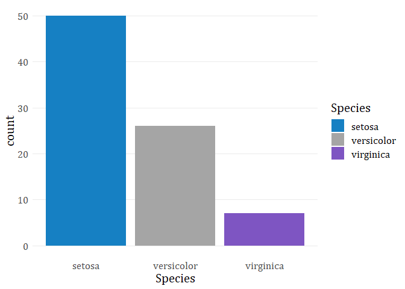

<!-- README.md is generated from README.Rmd. Please edit that file -->

# mhscales

Provides color palettes that align with the colors for the Missouri
Historical Society. The palettes were created for use with `ggplot2`
charts but some objects may also be useful for setting file template
colors, etc. The primary functions are `scale_color_mhs()` and
`scale_fill_mhs()`. I used this
[tutorial](https://drsimonj.svbtle.com/creating-corporate-colour-palettes-for-ggplot2)
as guidance in creating these functions.

The objects in this package were initially created while volunteering
with the Missouri Historical Society.

Screenshot from <https://mohistory.org/society> :


Load packages, set theme:

``` r
library(ggplot2)
library(mhscales)
library(dplyr)
library(extrafont)
# extrafont::font_import()
# loadfonts(device = "win")

theme_set(theme_minimal()+
  theme(text = element_text(size = 16, family = "Cambria"))
)
```

## Installation

Install from github:

``` r
if (!requireNamespace("devtools")) install.packages("devtools")
devtools::install_github("brshallo/mhscales")
```

## Data

There are palettes defined for each of:

  - Missouri Historical Society (mhs)
  - Missouri History Museum (mhm)
  - Library & Research Center (lrc)
  - Soldiers Memorial Military Museum (smm)

As well as combinations of these.

``` r
mhscales::mhs_palettes
#> $mhs
#>      blue dark blue 
#> "#1680C3" "#0E547F" 
#> 
#> $mhm
#>      purple dark purple 
#>   "#7E55C2"   "#523875" 
#> 
#> $lrc
#>      teal dark teal 
#> "#0098A7" "#00747F" 
#> 
#> $smm
#>      gold dark gold 
#> "#F6A600" "#7F5600" 
#> 
#> $grey
#>      grey dark grey 
#> "#BEBEBE" "#A5A5A5" 
#> 
#> $mhs_mhm
#>      blue dark grey    purple 
#> "#1680C3" "#A5A5A5" "#7E55C2" 
#> 
#> $mhs_mhm_all
#>        blue   dark grey      purple   dark blue        grey dark purple 
#>   "#1680C3"   "#A5A5A5"   "#7E55C2"   "#0E547F"   "#BEBEBE"   "#523875"
```

## Example

You can set as continuous scales:

``` r
ggplot(iris, aes(Sepal.Width, Sepal.Length, color = Sepal.Length)) +
 geom_point(size = 2) +
 scale_color_mhs(palette = "smm", discrete = FALSE)
```


As discrete scales:

``` r
ggplot(iris, aes(Sepal.Width, Sepal.Length, color = Species)) +
 geom_point(size = 2) +
 scale_color_mhs(palette = "mhs_mhm", discrete = TRUE)
```


Equivalent functions exist for the fill aesthetic:

``` r
iris %>% 
  filter(Sepal.Length < 6) %>% 
  ggplot(aes(x = Species, fill = Species)) +
  geom_bar()+
  scale_fill_mhs(palette = "mhs_mhm", discrete = TRUE)+ 
  theme(panel.grid.major.x = element_blank(),
        panel.grid.minor.y = element_blank())
```



``` r
ggplot(iris, aes(x = Sepal.Length, fill = ..count..)) +
  geom_histogram()+
  scale_fill_mhs(palette = "smm", discrete = FALSE)+
  ylim(c(0, 15))
#> `stat_bin()` using `bins = 30`. Pick better value with `binwidth`.
```


